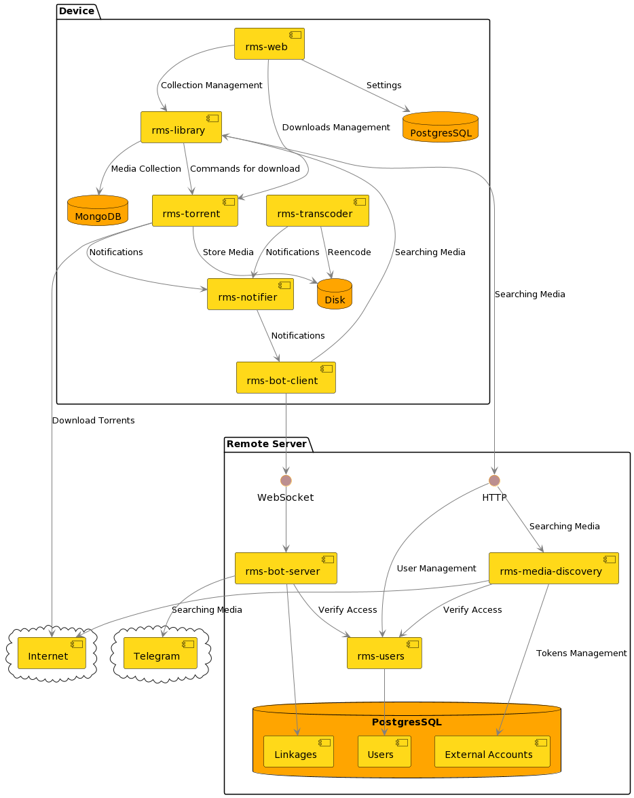

* [Racoon Media Server](#racoon-media-server)
  * [Концепт](#концепт)
  * [Features](#features)
  * [Технологический стек](#технологический-стек)
  * [Архитектура](#архитектура)
    * [Device](#device)
      * [Микросервисы](#микросервисы)
      * [Скрипты и конфиги](#скрипты-и-конфиги)
    * [Remote Server](#remote-server)
      * [Причины появления **Remote Server**](#причины-появления-remote-server)
      * [Микросервисы](#микросервисы-1)
      * [Скрипты и конфиги](#скрипты-и-конфиги-1)

# Racoon Media Server

Architecture overview &amp; Documentation

## Концепт

Базовая идея была в том, чтобы иметь у себя дома удобную и вменяемую инфраструктуру, отвечающую следующим запросам:
1. Загружать любой медиа-контент с торрентов по запросу (на стриминговых сервисах очень часто чего-то нет или неправильная озвучка);
2. Возможность просматривать контент с различных устройств (телевизоры, приставка и пр.);
3. Транскодировать контент в случае, если не удается воспроизвести на каком-то устройстве;
4. Иметь связанную со всем этим "файло-помойку";
5. Развернуть и интегрировать различные 3rd-party сервисы (органайзеры, календари и пр.), организовать для них точку входа;
6. Привязать ко всему этому функционал системы видеонаблюдения, достаточный для домашнего использования.

**_Зачем?_** 

* Самому удобно; 
* Потренироваться в разработке на Go;
* Поиметь небольшой опыт в System Design;
* Показал друзьям - они такую же штуку захотели...

## Features

_Не все еще перенесено из приватных репозиториев и оформлено_

* Веб-интерфейс;
* К некоторым функциям присутсвует доступ через Telegram-бот;
* Поиск информации о фильмах/сериалах ([IMDB](https://www.imdb.com/),  [Кинопоиск](https://www.kinopoisk.ru/));
* Поиск и выбор оптимальных раздач ([RuTracker.org](https://rutracker.org/), [Rutor](http://www.rutor.info/), [The Pirate Bay](https://thepiratebay.org/));
* Каталогизация контента (_еще в разработке_);
* Оповещение через Telegram, E-Mail, SMS;
* Транскодирование видео;
* Система видеонаблюдения (**в публичном репозитории отсутствует**);
* Рестриминг видео (**в публичном репозитории отсутствует**);
* Сбор тревожных событий с камер и нотификация (**в публичном репозитории отсутствует**);
* Ряд встроенных 3rd-party сервисов ([Nextcloud](https://nextcloud.com/), [Serviio](https://www.serviio.org/download), [Gitea](https://gitea.io/en-us/)).

## Технологический стек

* [Go](https://go.dev/);
* [Go-Micro](https://micro.dev/);
* [MongoDB](https://www.mongodb.com/);
* [PostgreSQL](https://www.postgresql.org/);
* [Gin](https://gin-gonic.com/);
* [Gorm](https://gorm.io/).

## Архитектура

* **Device** - набор сервисов, которые выполняются на физическом устройстве пользователя (одноплатный компьютер, сервер и т. д.)
* **Remote Server** - набор сервисов, которые работают на удаленном сервере (например, на моем VPS).

### Device

У меня все эти компоненты работают на домашнем сервере. В дальнейшем планирую попробовать развернуть на одноплатный копмьютер...

#### Микросервисы

* [rms-libary](https://github.com/RacoonMediaServer/rms-library) - библиотека мультимедия;
* [rms-torrent](https://github.com/RacoonMediaServer/rms-torrent) - торрент-клиент;
* [rms-notifier](https://github.com/RacoonMediaServer/rms-notifier) - сервис рассылки уведомлений;
* [rms-web](https://github.com/RacoonMediaServer/rms-web) - веб-интерфейс;
* [rms-transcoder](https://github.com/RacoonMediaServer/rms-transcoder) - сервис транскодирования видео.

#### Скрипты и конфиги

Запускается из под docker-compose. Вынесены в отдельный [репозиторий](https://github.com/RacoonMediaServer/rms-device).

### Remote Server

#### Причины появления **Remote Server**

* хотелось, чтобы один Telegram-бот мог обслуживать множество клиентов сразу. Делать бота для каждого **Device** не удобно;
* на внешних сайтах, которые используются для поиска медиа периодически возникают изменения, и поиск перестает работать. Эта логика вынесена на удаленный сервер - чтоб там можно ее было починить и у всех пользователей все бы работало;
* алгоритмы "эвристического" анализа также удобно улучшать собирая статистику с единой точки входа;
* для доступа к торрент-трекерам из рунета все равно нужны VPS & VPN... Локальные средства на **Device** могут отвалиться и перестать работать.

#### Микросервисы

* [rms-media-discovery](https://github.com/RacoonMediaServer/rms-media-discovery) - сервис для поиска в Интернете информации о медиа и ссылок на загрузку;
* [rms-bot-server](https://github.com/RacoonMediaServer/rms-bot-server) - Telegram-бот, которые может обсуживать сразу множество пользовательских устройств;
* [rms-users](https://github.com/RacoonMediaServer/rms-users) - сервис упрощенной идентификации пользователских устройств.

#### Скрипты и конфиги

Запускается из под docker-compose. Вынесены в отдельный [репозиторий](https://github.com/RacoonMediaServer/rms-remote).
